## Installation and Usage Guide for ProFormA Integration with VPL Plugin on Moodle

This guide provides step-by-step instructions for installing and using the ProFormA integration with the Virtual Programming Lab (VPL) plugin in Moodle. It includes installation steps, configuration for VPL activities, and example usage scenarios.

---

## Part 1: Installation

### A. Install the VPL Plugin on Moodle
1. **Introduction**: The VPL plugin enables automatic assessment of programming tasks within Moodle.
2. **Download & Install**: Refer to the [Moodle Plugin Directory](https://moodle.org/plugins/view.php?plugin=mod_vpl) for plugin download and installation instructions.

---

### B. Set Up the Jail-Server
1. **Purpose**: The Jail-Server is a secure sandbox environment where student code is executed and assessed.

2. **Installation Steps**:

   - Install the Jail-Server on a separate machine, virtual environment, or using VirtualBox.
   - Download the Jail-Server source files from [VPL’s official website](https://vpl.dis.ulpgc.es/).
   - Run the `install_vpl.sh` script after unzipping the files to complete the installation.

3. **Configuration**:

   - Configure the server URL in `/etc/vpl/vpl_jail_server.conf`.
   - Additional security settings, such as SSL certificates, can be configured as needed.

---

### C: Configure the VPL Plugin
In Moodle, navigate to **Site administration > Plugins > Plugins overview > mod_vpl > Settings** to configure the VPL plugin for communication with the Jail-Server.

1. **Add the Jail-Server URL**: Enter the Jail-Server URL you set up in the previous step into the **Execution servers list**.
2. **Disable Other Servers**: Ensure all other server options are commented out or removed.

   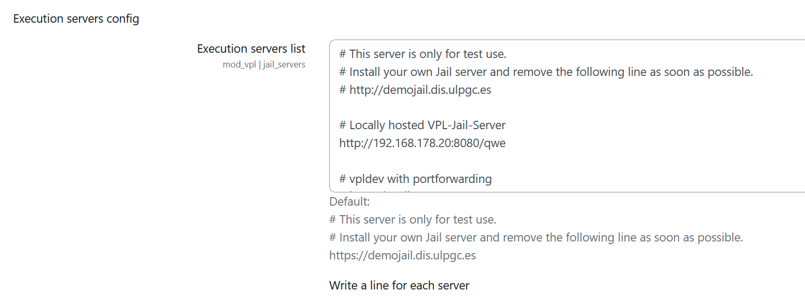

---

## Part 2: Configuring and Using VPL/ProFormA Activities

### A. Create and Configure a VPL Activity

1. **Create a New VPL Activity**:

   - In Moodle, go to your course and create a new VPL activity. Name and describe the activity for clarity.
   - If students need to submit multiple files, set "Maximum number of files" to a number greater than 1 under "Submission restrictions".

     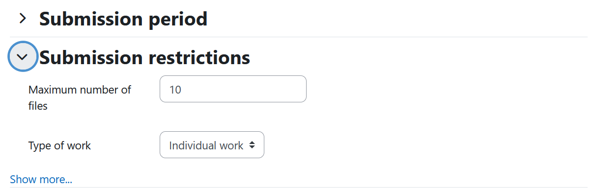

2. **Configure Execution Settings**:

   Go to "Execution options" and enable the "Run", "Debug", and "Evaluate" settings to allow students to execute and submit code.

   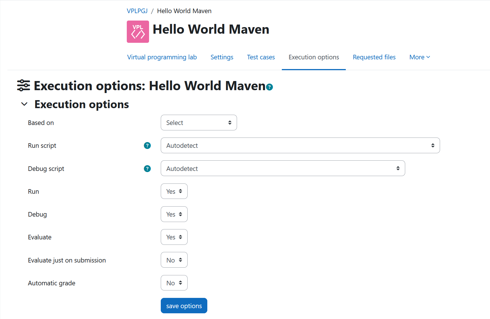

3. **Optional Configuration**:

   - Set a "Based on" activity for this activity. See the [Based-On Feature](#3-using-the-based-on-feature-to-simplify-activity-setup) section for details.
   - Enable "Evaluate just on submission" and "Automatic grade". Refer to the [Execution Options Configuration](https://vpl.dis.ulpgc.es/documentation/vpl-3.4.3+/basicfeatures.html#selecting-programming-language-tools) for more information.
   - Under "More/Maximum execution resources limits", configure the resource limits per student submissions if needed.

     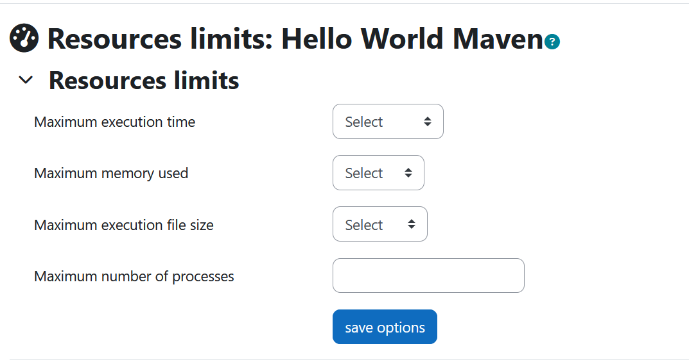

   - In "Requested files", specify files that will be visible to students during the task (e.g., library files or starter code). Refer to the [Execution Options Configuration](https://vpl.dis.ulpgc.es/documentation/vpl-3.4.3+/basicfeatures.html#requested-files) for more information.

     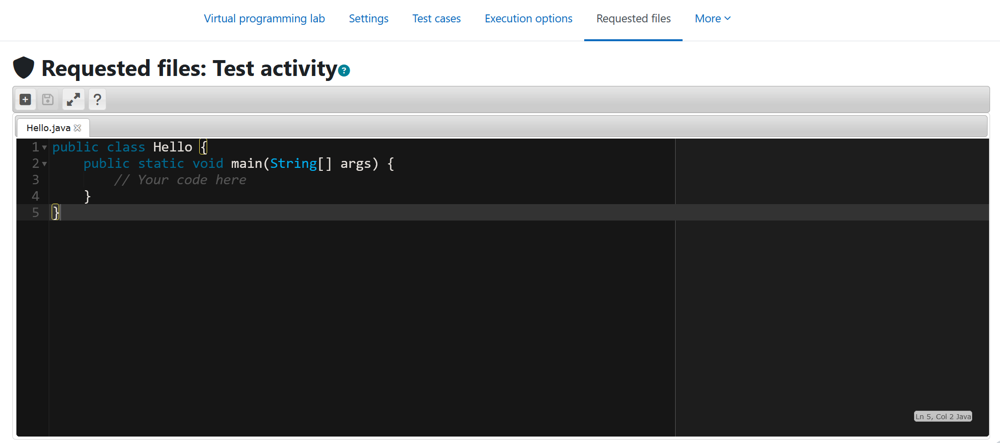

---

### B. Upload Execution Files and Enable ProFormA Integration

Navigate to "More/Execution files" to upload the necessary files.

#### Tips for Uploading

Uploading can be accomplished by:

- **Drag-and-Drop**: Use the drag-and-drop feature to upload the ZIP file directly into the VPL interface. This method is faster than navigating through the file system.   
- **Import**: Expand the tool bar with the "+" symbol and then click the Import symbol (upwards arrow). Or try the keyboard shortcut `Ctrl + I`.
- **ZIP files**: One thing to note is that VPL always unzips uploaded zipped files automatically. VPL seems to deny uploading of ZIP files with UTF-8 encoded filenames.
- **Save Changes**: Always save your changes after uploading by pressing `Ctrl + S` or clicking the "Save" button in the interface.

#### Files to be uploaded

1. **Replace `vpl_evaluate.sh`**:
   
   Upload the customized `vpl_evaluate.sh` script in the "Execution files" tab to replace the default VPL script. This script enables ProFormA-based grading. 

   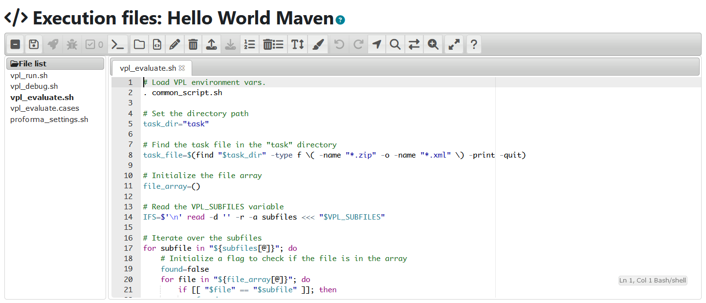

2. **Add `proforma_settings.sh`**:

   Upload the `proforma_settings.sh` script in the same "Execution files" tab. This file lets instructors configure the grader (e.g., Graja, GraFlap) and set grading parameters.

   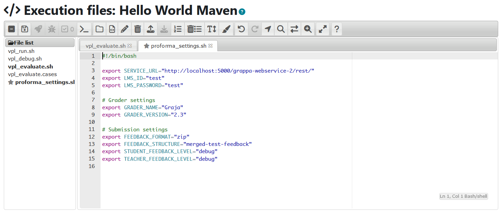

3. **Upload the ProFormAFormatter Fat Jar**:

   Upload the `ProformaFormatter-<version>-fat-jar-with-dependencies.jar` directly into the "Execution files" tab. This file serves as a bridge between VPL and Grappa, enabling ProFormA-based communication with graders.

   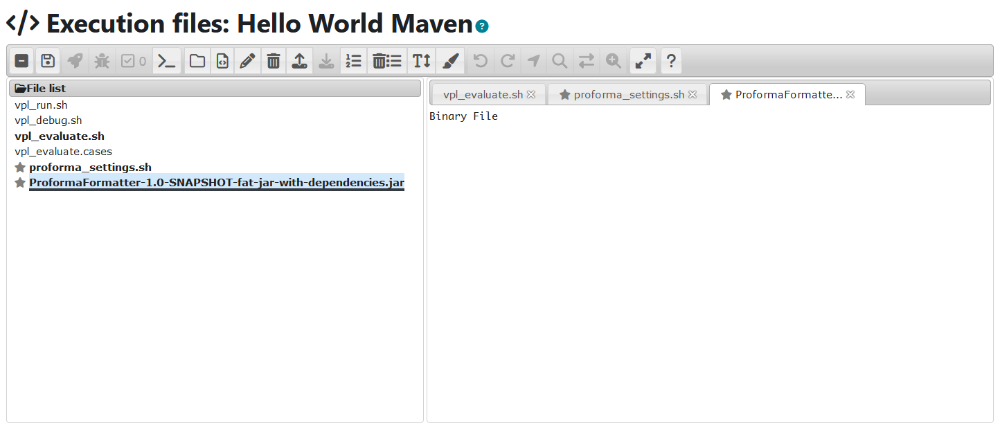

4. **Upload the ProFormA Task File**:

   In the "Execution files" tab, the ProFormA task file must be uploaded under a folder named `task` for the program to function correctly. Since VPL unzips uploaded ZIP files automatically, you should follow these steps based on the type of file you are uploading:

   a. **If the task file is a ProFormA ZIP file** (e.g., `helloworld.zip`):

      - Within your file system, locate the ZIP file containing the ProFormA task file (e.g., `helloworld.zip`).
      - Place this ZIP file inside a folder named `task`.
      - Zip the entire `task` folder. The resulting structure should look like this:
        ```
        task
        ├── helloworld.zip
        ```
      - Upload this outer ZIP file. VPL will unzip it, creating the required directory structure with the ProFormA task file inside the `task` folder.\
       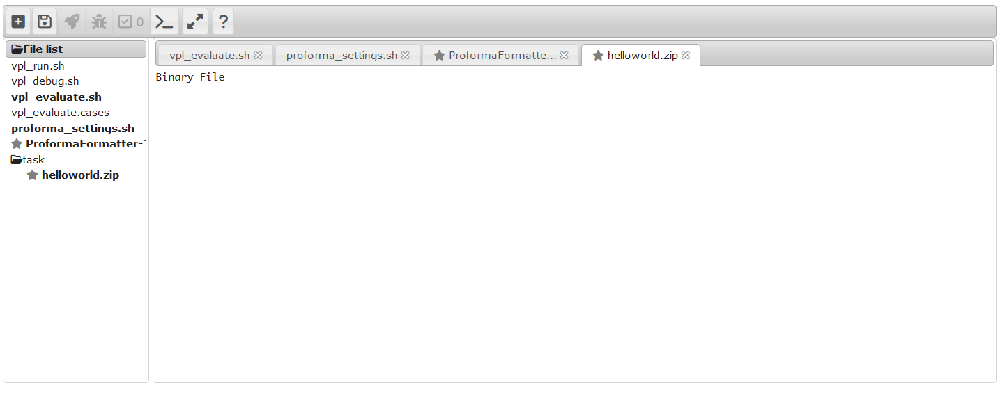

   b. **If the task file is an XML file** (e.g., `helloworld.xml`):
      - Place the `helloworld.xml` file directly into a folder named `task`.
      - Zip the entire `task` folder. The resulting structure should look like this:
        ```
        task
        ├── helloworld.xml
        ```
      - Upload this outer ZIP file. VPL will unzip it, creating the required directory structure with the `helloworld.xml` file inside the `task` folder.

5. **Mark Files to Keep When Running**:
   
   Mark `proforma_settings.sh`, the `ProformaFormatter-<version>-fat-jar-with-dependencies.jar`, and the ProFormA task file in the `task` folder as "Files to Keep When Running" to prevent them from being deleted after execution.

   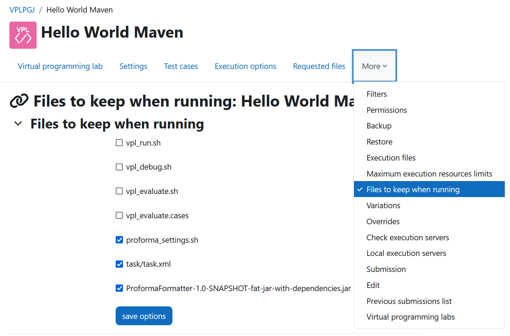

---

### C. Using the Based-On Feature to Simplify Activity Setup

The "Based-On" feature in VPL allows you to create a generic "Base Activity" that serves as a template for other VPL activities, streamlining setup. A detailed example is described in the section [Based-On Example](#example-2-using-a-based-on-base-activity-for-new-activities).

1. **Create a Base Activity**:

   Set up a VPL activity in Moodle with essential configurations, including execution scripts, grading settings, and "Files to Keep When Running" (such as `proforma_settings.sh` and the `ProformaFormatter-<version>-fat-jar-with-dependencies.jar`).

2. **Execution Files Inheritance**:

   Execution files in the base activity will automatically apply to new activities created with the "Based-on" feature. Custom scripts like `vpl_evaluate.sh` will be appended from the base if the current activity contains its own version.

3. **Configure Expiration and Hide Base Activity**:

   - Set the base activity with no due date to ensure it's available for the entire course duration.

     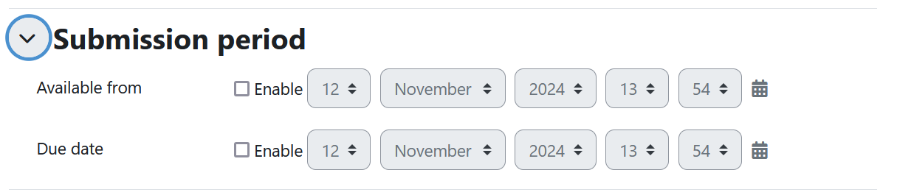

   - Hide the base activity from students to avoid confusion by setting its visibility to "Hidden".

     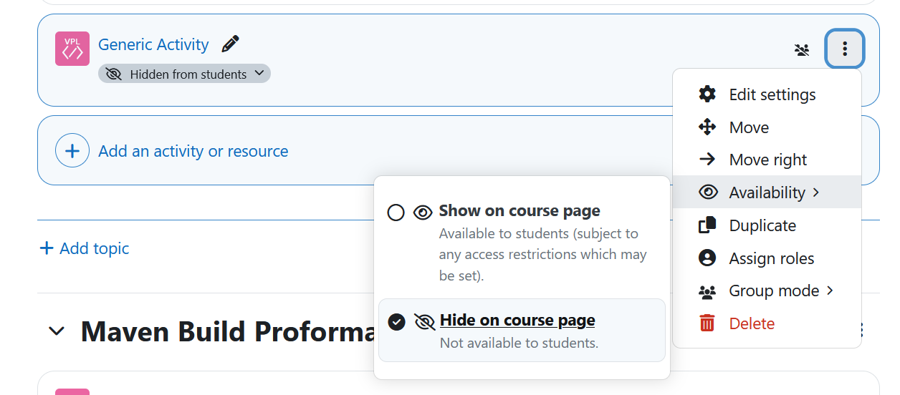

4. **Choose How to Use the Base Activity**:

   - When `proforma_settings.sh` is included in the base activity's "Execution files", all inheriting activities will share this configuration. To specify a different grader or settings, override the base `proforma_settings.sh` file by adding a new one in the inheriting activity.
   - Alternatively, you can create multiple base activities, each configured for a different ProFormA grader.
   - It is also possible to layer base activities. For example, create a primary base activity that defines core execution scripts, then add secondary base activities for specific `proforma_settings.sh` configurations, allowing flexible inheritance across multiple activities.

---

## Part 3: Example Configurations

### Example E1: Creating a VPL Activity with ProFormA Integration from Scratch

This example demonstrates how to create a basic new VPL activity and integrate it with ProFormA and the the Graders.

1. **Basic Setup**:
   - Create a new VPL activity in your course.
   - Set the name and description.
   - Configure the "Maximum number of files" setting as required.
2. **Upload ProFormA Integration Files**:
   - In "Execution files", upload `vpl_evaluate.sh`, `proforma_settings.sh`, and the `ProformaFormatter-<version>-fat-jar-with-dependencies.jar` directly.
   - Create a folder named `task` in "Execution files" and upload the ProFormA task file into this `task` folder.
3. **Mark Files to Keep**:
   Go to "More/Files to keep when running" and mark `proforma_settings.sh`, the `ProformaFormatter-<version>-fat-jar-with-dependencies.jar`, and the ProFormA task file within the `task` folder.
4. **Finalize Activity Configuration**:
   Under "Execution options", set "Run", "Debug", and "Evaluate" to "Yes" to enable these features for students.
5. **Testing**:
   Go to "Virtual programming lab/Test activity/Edit" and run a test evaluation to verify ProFormA integration.

---

### Example E2: Using a Based-On Base Activity for New Activities

This example illustrates how to use the Based-On feature with a base activity.

1. **Set Up the Base Activity**:
   - Create a VPL activity that will serve as a base for other VPL activities.
   - Under "Settings", remove the "due date" to keep it accessible throughout the entirety of hte course duration.
   - Hide the activity from students to maintain a clean course structure.
   - Upload the execution scripts (custom `vpl_evaluate.sh` script and `proforma_settings.sh` script) and the `ProformaFormatter-<version>-fat-jar-with-dependencies.jar` to "Execution files".
   - In "Execution options", set "Run", "Debug", and "Evaluate" to "Yes".
   - Go to "More/Files to Keep When Running" and check the boxes for `proforma_settings.sh` and the `ProformaFormatter-<version>-fat-jar-with-dependencies.jar`.
2. **Create a New Activity Based on the Base Activity**:
   - Create a new VPL activity in your course.
   - In "Execution options", select the base activity from the previous step in the "Based-on" dropdown.
   - This new activity will inherit all configurations from the base, including execution files and grading settings.
   - Under "More/Execution files", upload the ProFormA task file in a `task` folder.
   - Under "Files to Keep When Running", mark the uploaded ProFormA task file to prevent deletion.
3. **Testing**:
   Go to "Virtual programming lab/Test activity/Edit" and run a test evaluation to verify ProFormA integration.

---

This installation and usage guide provides the necessary steps to install, configure, and utilize ProFormA with VPL in Moodle. For additional details, please refer to the [thesis](https://doi.org/10.25968/opus-3176) and [official VPL documentation](https://vpl.dis.ulpgc.es/).