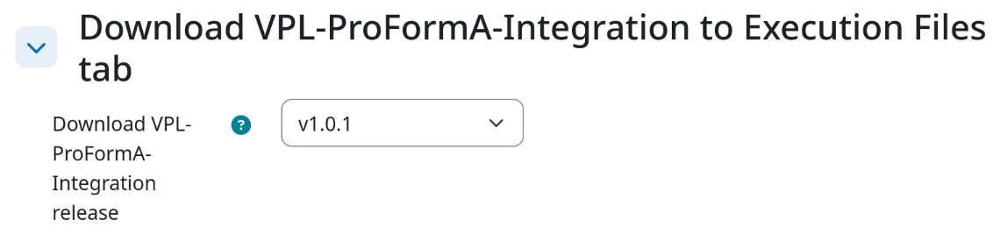
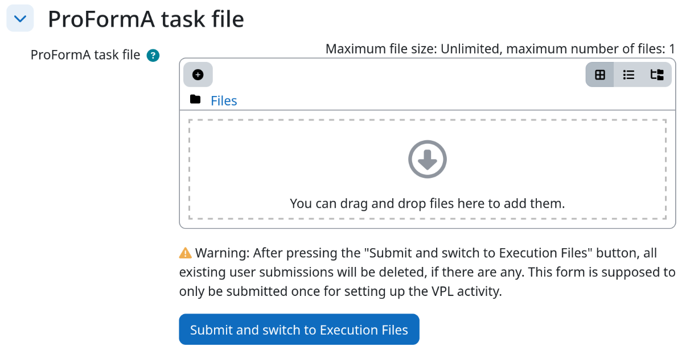
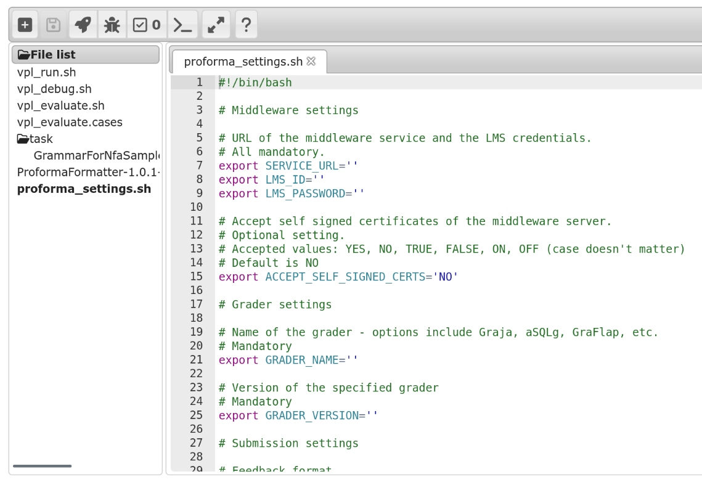

# Teacher usage Guide for ProFormA Integration with the VPL Plugin on Moodle

This guide provides step-by-step instructions on how to use the ProFormA integration with the Virtual Programming Lab (VPL) plugin in Moodle. It explains how to set up an example VPL activity that uses the ProFormA integration to connect with a ProFormA-compatible grader for automatically assessing students’ submissions. For additional information, please refer to the [official VPl documentation](https://vpl.dis.ulpgc.es/) and [this thesis](https://doi.org/10.25968/opus-3176).

---

## Part A: Setting up the VPL activity

1. **Create a New VPL Activity**:

   - In Moodle, go to your course and create a new VPL activity. The name and description will be automatically extracted from the ProFormA task file. For now, you can give the activity any name.

2. **Open ProFormA task settings through Execution options**:

   - Inside the new VPL Activity, naviate to the "Execution options" tab.
   - Right above the "Save options" button, click on "Open ProFormA task settings page".

   

3. **Download VPL-ProFormA-Integration to Execution Files tab**

   - To use VPL alongside a ProFormA task, you need to download the VPL-ProFormA-Integration from GitHub and add it to the Execution Files tab. This can be done automatically by just selecting the desired release in the dropdown-menu.

   

4. **Upload the ProFormA task file**

   - Upload the ProFormA *task.xml* file through the file selector.
      - The *task.xml* file can be dropped separately in the file upload menu or multiple files can be uploaded as a zip file. The zip must also contain the *task.xml* file.
   
   

   - **Warning**: As already displayed in the image above, after pressing the "Submit and switch to Execution Files" button, all existing user submissions will be deleted. The whole process described in this document is supposed to be only done once for setting up the VPL activity with the VPL-ProFormA-Integration.

5. **Configure grader settings**

   - After pressing "Submit and switch to Execution Files", the Browser will be navigated to the "Execution Files" tab containing VPL's file editor.
   - In the File list on the left inside the file editor, open the *proforma_settings.sh* file.
      - If the sidebar on the left isn't visible, press the "+" icon on the top-left and then press the folder icon.
   - Fill the attributes inside the file with the necessary information. Each attribute is described in Part B of this document.

   

6. **Done**

   - After the *proforma_settings.sh* file has been configured, the grading of this VPL activity is achieved using a ProFormA compatible grader. 

## Part B: Attribute descriptions in *proforma_settings.sh*

This section describes every attribute found inside the *proforma_settings.sh* file. Each of those attributes must be set before a grading using a ProFormA compatible grader can be accomplished. Some of those attributes already have default values set inside the file. Also refer to the comments inside *proforma_settings.sh*.

| Attribut | Beschreibung |
|-|-|
| SERVICE_URL | URL of the used ProFormA middleware web service (eg. Grappa)|
| LMS_ID | LMS ID used to connect to the web service |
| LMS_PASSWORD | LMS password for the provided LMS ID |
| ACCEPT_SELF_SIGNED_CERTS | Should a connection to the webservice be established if it uses self-signed TLS certificates? (Default: No) |
| GRADER_NAME | Name of the grader used for the uploaded task, as it is configured on the web service |
| GRADER_VERSION | Version of the used grader as it is configured on the web service |
| FEEDBACK_FORMAT | Should the grading feedback be sent back as zip or xml? (Default: zip) |
| FEEDBACK_STRUCTURE | Which feedback structure (separate or merged test feedback) should be sent back? (Default: separate-test-feedback) |
| STUDENT_FEEDBACK_LEVEL | The level of information that a student should receive in the feedback after a grading (Default: info) |
| TEACHER_FEEDBACK_LEVEL | The lebel of information that a teacher should receive in the feedback after a grading (Default: info) |

The set of attributes inside *proforma_settings.sh* can change with each new version of the VPL-ProFormA-Integration. This document represents the configuration for the latest version, which is currently 1.0.1 as of 23.10.2025.